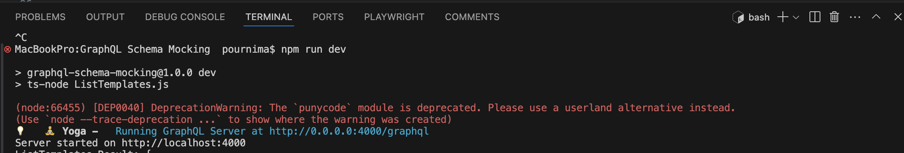

# GraphQL Schema Mocking

This project is a GraphQL server implementation that utilizes GraphQL Tools to define a schema, resolvers, and types. It serves as a mock for testing and development purposes, The mock data for a GraphQL API, which is useful for testing and development without needing a fully implemented backend.

## Project Structure

```
graphql-schema-mocking/
├── src/
│   ├── MockAPI/
│   │   ├── index.js
│   │   ├── listTemplates.js
│   │   ├── fetchWAMessage.js
│   │   ├── mutation.js
│   │   └── scalars.js
│   ├── utils/
│   │   ├── index.js
│   │   └── formatDate.js
│   ├── schema.graphql
│   └── server.js
├── .env
├── package.json
└── README.md
```


## Project Structure
* `src/schema.graphql`: Contains the GraphQL schema definitions.
* `src/resolvers/`: Contains the resolver functions for queries, mutations, and custom scalars.
  * `index.js`: Combines all resolvers.
  * `query.js`: Contains query resolvers.
  * `mutation.js`: Contains mutation resolvers.
  * `scalars.js`: Contains custom scalar resolvers.
* `src/utils/`: Contains utility functions.
  * `index.js`: Combines all utility functions like mock data.
  * `formatDate.js`: Contains the `formatDate` function to format dates.
* `src/server.js`: Sets up and starts the GraphQL server.

## Setup Instructions

1. **Clone the repository:**
   ```bash
   git clone <repository-url>
   cd GraphQL-Schema-Mocking

2. **Install dependencies:**
   ```
   npm install
   ```

3. **To Make Executable Schema:**
   ```
   npm i @graphql-tools/schema
      ```
4. **To use mock data:**
   ```
   npm install @graphql-tools/mock
   ```
5. **To access the .env veriable file:**
   ```
   npm install dotenv
   ```
6. **Run the server:**
   ```
   npm start
   ```
## Getting Started

### Prerequisites

- Node.js (version 14 or higher)
- npm (version 6 or higher)

### Installation

1. Clone the repository:

```bash
git clone https://github.com/your-username/graphql-schema-mocking.git
cd graphql-schema-mocking
```

## Create a *.env* file in the root directory with the following content:
```
BANDWIDTH=10,20,30
DEVICE=Device1,Device2,Device3
NETWORK_TYPE=Type1,Type2,Type3
CHANNEL=mock_channel
```
# Running the Server
## Start the server:
   ```
   npm run dev
   ```
   
## Usage

Once the server is running, you can access the GraphQL playground at `http://localhost:4000` (or the port specified in your configuration) to test your queries and mutations.


### API Result with mock data


